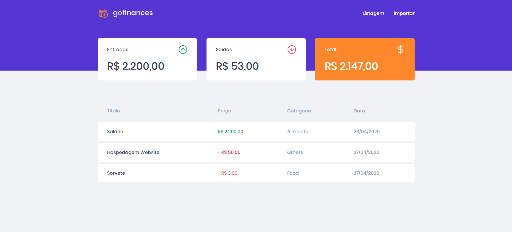
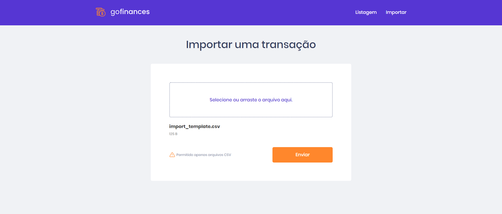

# Transactions Application

Its an application to manage transactions with the amount of expense in products or services.
This application also use drag and drop system to import csv files for new transactions.

**&copy;  [Rocketseat](https://rocketseat.com.br/)**


<h3> It was developed in TypeScript using technologies:  React and  NodeJS


## Installation

First you need to clone the project, then it will be necessary a yarn or node to manage dependencies/packages

After you have attended the requirements, execute the following to download and install dependencies
```yarn```
or
```npm install```

Later, you will have to start the local server to launch GitHub Explorer
```npm start```
or
```yarn start```


## Application Pages

<p align="center">
    
    
</p>
